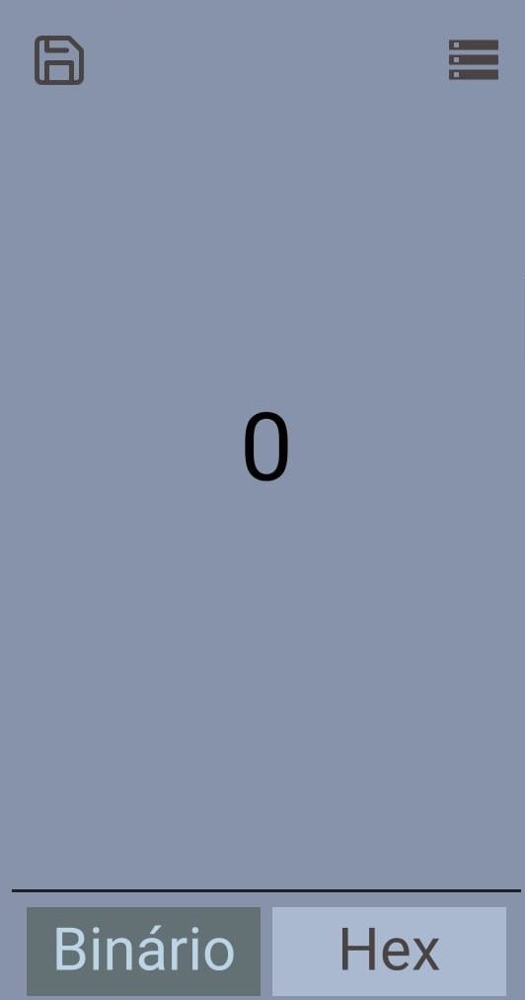
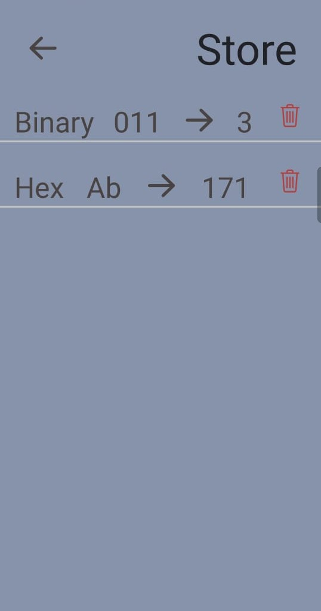

# Mobile Version

As in the web application, you can convert binary numbers and hexadecimal, with the addition of being able to save thoses numbers.

## Views

### Home
Place where you can convert the numbers



### Store
Here, you can see the numbers that you saved



## Install

```
cd mobile

yarn
	or
npm install
```

## Starting

```
yarn start
	or
npm start
```