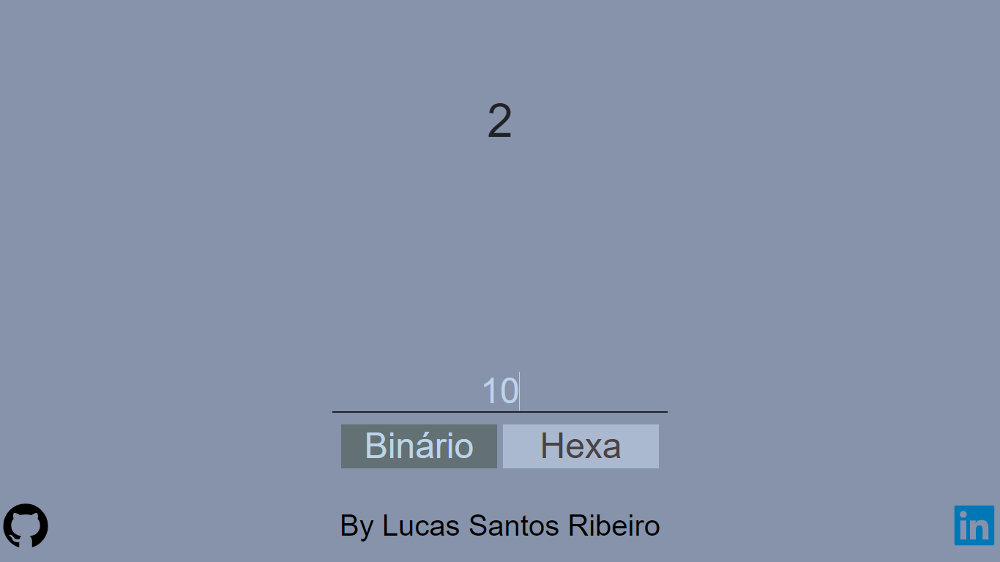

# Web Version

Web version of the aplicattion, here you can convert binary and hexadecimal numbers.

## View
### Home


## Install

```
cd web

yarn
	or
npm install
```

## Starting

```
yarn start
	or
npm start
```
